# Markdown syntax guide

Drücke Ctrl+Shift+V um die Live Preview zu öffnen.

Drücke Ctrl+K M um eine Programmiersprache auszuwählen.

## Headers

# This is a Heading h1
## This is a Heading h2
###### This is a Heading h6

## Emphasis

*This text will be italic*  
_This will also be italic_

**This text will be bold**  
__This will also be bold__

_You **can** combine them_

## Graphs


::: mermaid
graph TD;
    A-->B;
    A-->C;
    B-->D;
    C-->D;
:::

```mermaid
architecture-beta
    service user(mdi:account)
    service lambda(logos:aws-lambda)

    user:R --> L:lambda
```



 graph TB
         A[13,032] --> |Accept John's Offer| B[12,000]
         A ==> |Reject John's Offer |C(($13,032))
         C --> |Offer from Vanessa 0.6| D[$14,000]
         D ==> |Accept Vanessa's Offer| E[$14,000]
         D --> |Reject Vanessa's Offer| F(($11,580))
         C --> |No Offer from Vanessa 0.4| G(($11,580))
         G --> |Salary 1 0.05| H[$21,600]
         G --> |Salary 2 0.25| I[$16,800]
         G --> |Salary 3 0.40| J[$12,800]
         G --> |Salary 4 0.25| K[$6,000]
         G --> |Salary 5 0.05| L[$0]
         F --> |Salary 1 0.05| M[$21,600]
         F --> |Salary 2 0.25| N[$16,800]
         F --> |Salary 3 0.40| O[$12,800]
         F --> |Salary 4 0.25| P[$6,000]
         F --> |Salary 5 0.05| Q[$0]

## Lists

### Unordered

* Item 1
* Item 2
* Item 2a
* Item 2b
    * Item 3a
    * Item 3b

### Ordered

1. Item 1
2. Item 2
3. Item 3
    1. Item 3a
    2. Item 3b

## Images


## Links

You may be using [Markdown Live Preview](https://markdownlivepreview.com/).

## Blockquotes

> Markdown is a lightweight markup language with plain-text-formatting syntax, created in 2004 by John Gruber with Aaron Swartz.
>
>> Markdown is often used to format readme files, for writing messages in online discussion forums, and to create rich text using a plain text editor.

## Tables

| Left columns  | Right columns |
| ------------- |:-------------:|# Markdown syntax guide

## Headers

# This is a Heading h1
## This is a Heading h2
###### This is a Heading h6

## Emphasis

*This text will be italic*  
_This will also be italic_

**This text will be bold**  
__This will also be bold__

_You **can** combine them_

## Lists

### Unordered

* Item 1
* Item 2
* Item 2a
* Item 2b
    * Item 3a
    * Item 3b

### Ordered

1. Item 1
2. Item 2
3. Item 3
    1. Item 3a
    2. Item 3b

## Images


## Links

You may be using [Markdown Live Preview](https://markdownlivepreview.com/).

## Blockquotes

> Markdown is a lightweight markup language with plain-text-formatting syntax, created in 2004 by John Gruber with Aaron Swartz.
>
>> Markdown is often used to format readme files, for writing messages in online discussion forums, and to create rich text using a plain text editor.

## Tables

| Left columns  | Right columns |
| ------------- |:-------------:|
| left foo      | right foo     |
| left bar      | right bar     |
| left baz      | right baz     |

## Blocks of code

```
let message = 'Hello world';
alert(message);
```

## Inline code

This web site is using `markedjs/marked`.
| left foo      | right foo     |
| left bar      | right bar     |
| left baz      | right baz     |

## Blocks of code

```
let message = 'Hello world';
alert(message);
```

## Inline code

This web site is using `markedjs/marked`.
