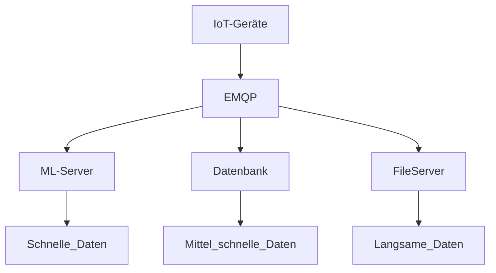
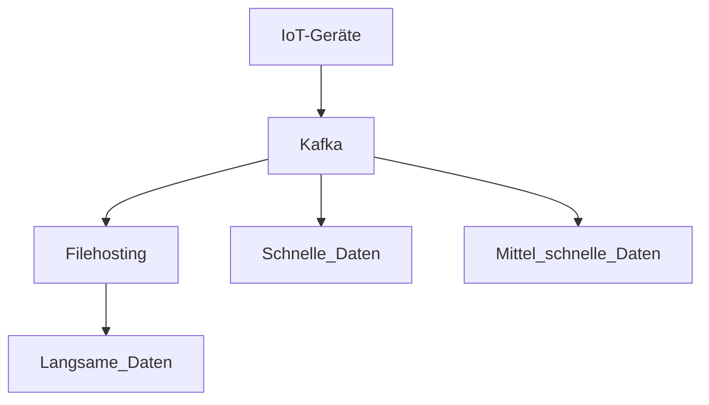

# Kafka Simulation

## Basiert auf meiner Abschlussarbeit

### Übersicht

**Alter Aufbau**

**Neuer Aufbau**

---

## Aufgaben

### 1. Zeitplan erstellen
Vorläufigen Zeitplan für die bisherige Umsetzungsdauer aller Aufgaben definieren.

### 2. Anforderungen erarbeiten
Welche Bedingungen existieren momentan und wie müssen wir uns daran anpassen?  
Was muss alles beachtet werden?  
Was sind die Erfolgskriterien, nach denen das Projekt abgeschlossen werden kann?

### 3. Anforderungsheft erstellen  
Alle Anforderungen in einem Anforderungsdokument zusammenfassen.

### 4. Erfolgskriterienheft erstellen  
Alle Erfolgskriterien in einem Erfolgskriteriendokument festhalten.

### 5. Simulation erstellen  
Analyse, wie eine Simulation das Projekt unterstützen kann.  
Simulation aufbauen, Ergebnisse bewerten und einordnen.

### 6. Projekt beginnen  
Ergebnisse zusammentragen, auswerten und dokumentieren.  
Ein Paper zur Weitergabe erstellen.

### 7. Projekt beenden  
Paper finalisieren.  
Zeitunterschiede geplant vs. real analysieren und dokumentieren.  
Abschließende Erkenntnisse ausarbeiten und festhalten.  
Alle Dokumente in einem finalen *Kafka-Machbarkeitsstudium* bündeln.

---

## Projektstruktur

### Zeitplan

### Anforderungen

- Sicherheit  
- Throughput  
- Latenz  
- Versionierung  
- Kafka-Konfiguration  
- Kosten  

### Erfolgskriterien

- Machbarkeit  
- Wettbewerbsvorteil  

### Simulation

- Kafka-Konfiguration testen  
- Datenraten messen  

---

## Benötigte Dokumente

- Interne Anforderungen  
- Kafka-Konfiguration  
- Vergleichbare Studien  
- Methodikablauf  
- Simulationserstellung  
- Paper schreiben  

---

## Aufgabenabarbeitungsliste (geplant)

### Zeitplan

**Anforderungen**  
- 1 Woche (5× 2 Stunden)

**Erfolgskriterien**  
- 1 Woche (5× 2 Stunden)

**Simulation**  
- 1 Woche (5× 2 Stunden)

**Projektphase**  
- 1 Woche (5× 2 Stunden)

---

Start: **22.09.2025**

--- 
Progammieraufbau

**Alter Aufbau**

Diesen kann man einfach simulieren und nachbauen

**Neuer Aufbau**

Iot Geräte kann man schnell bauen, Kafka muss ich aufsetzten und dann C# von Confluent verwenden

Insgesamt benötige ich:

- IoT-Devices (Variation)
- Konsumer (Variation)
- ML_Server
- DB
- EMQP Setup
- Kafka Setup

Idee:

- MicroServices ( C# )
    - IoT-Devices (Variation)
    - Konsumer (Variation)
- Needs Datatransformtion capabilites plus some time dilation ( C++ ?)
    - ML_Server
    - DB
    - FileServer
- Download Clients and connect via API ( C# connectors )
    - EMQP Setup
    - Kafka Setup