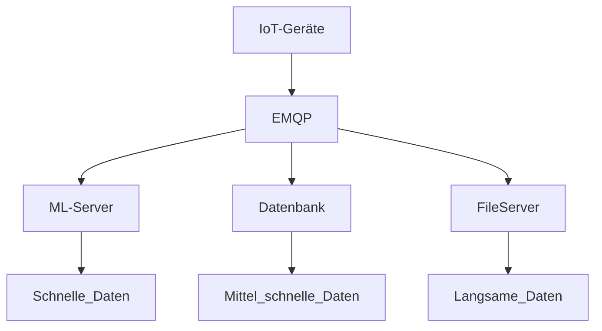
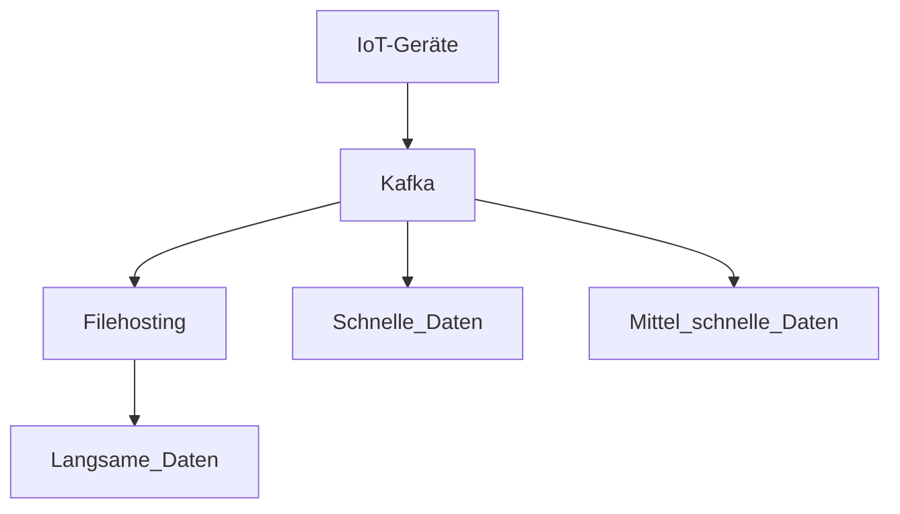

# Kafka Simulation

# Update: 18.01.26 20:00

## Basiert auf meiner Abschlussarbeit

### Übersicht

**Alter Aufbau**

**Neuer Aufbau**

---

## Aufgaben

### 1. Zeitplan erstellen
Vorläufigen Zeitplan für die bisherige Umsetzungsdauer aller Aufgaben definieren.

### 2. Anforderungen erarbeiten
Welche Bedingungen existieren momentan und wie müssen wir uns daran anpassen?  
Was muss alles beachtet werden?  
Was sind die Erfolgskriterien, nach denen das Projekt abgeschlossen werden kann?

### 3. Anforderungsheft erstellen  
Alle Anforderungen in einem Anforderungsdokument zusammenfassen.

### 4. Erfolgskriterienheft erstellen  
Alle Erfolgskriterien in einem Erfolgskriteriendokument festhalten.

### 5. Simulation erstellen  
Analyse, wie eine Simulation das Projekt unterstützen kann.  
Simulation aufbauen, Ergebnisse bewerten und einordnen.

### 6. Projekt beginnen  
Ergebnisse zusammentragen, auswerten und dokumentieren.  
Ein Paper zur Weitergabe erstellen.

### 7. Projekt beenden  
Paper finalisieren.  
Zeitunterschiede geplant vs. real analysieren und dokumentieren.  
Abschließende Erkenntnisse ausarbeiten und festhalten.  
Alle Dokumente in einem finalen *Kafka-Machbarkeitsstudium* bündeln.

---

## Projektstruktur

### Zeitplan

### Anforderungen

- Sicherheit  
- Throughput  
- Latenz  
- Versionierung  
- Kafka-Konfiguration  
- Kosten  

### Erfolgskriterien

- Machbarkeit  
- Wettbewerbsvorteil  

### Simulation

- Kafka-Konfiguration testen  
- Datenraten messen  

---

## Benötigte Dokumente

- Interne Anforderungen  
- Kafka-Konfiguration  
- Vergleichbare Studien  
- Methodikablauf  
- Simulationserstellung  
- Paper schreiben  

---

## Aufgabenabarbeitungsliste (geplant)

### Zeitplan

**Anforderungen**  
- 1 Woche (5× 2 Stunden)

**Erfolgskriterien**  
- 1 Woche (5× 2 Stunden)

**Simulation**  
- 1 Woche (5× 2 Stunden)

**Projektphase**  
- 1 Woche (5× 2 Stunden)

---

Start: **22.09.2025**

--- 
Progammieraufbau

**Alter Aufbau**

Diesen kann man einfach simulieren und nachbauen

**Neuer Aufbau**

Iot Geräte kann man schnell bauen, Kafka muss ich aufsetzten und dann C# von Confluent verwenden

Insgesamt benötige ich:

- IoT-Devices (Variation)
- Konsumer (Variation)
- ML_Server
- DB
- EMQP Setup
- Kafka Setup

Idee:

- MicroServices ( C# )
    - IoT-Devices (Variation)
    - Konsumer (Variation)
- Needs Datatransformtion capabilites plus some time dilation ( C++ ?)
    - ML_Server
    - DB
    - FileServer
- Download Clients and connect via API ( C# connectors )
    - EMQP Setup
    - Kafka Setup

# WORKFLOW GOALs
Your workflow goal

Simulation orchestrator

 - Reads “scenario” JSONs: light / medium / hard

 - Determines how many workers of each type to spawn
 
 - ipc to worker manager process to spawn new ones
 - - async while wait connection 

 - aggregeates log files after

Producer Worker Manager Process

 - supports both ipc and each 5m. reading a .json config file
 - - updates worker config spawns

 - runtime logging of each worker to queue to write stuff down

 - async since consumer might get overwhelmed

Consumer Worker Manager Process

 - for MLServer and such

 - should be a set / const value of consumers

 - handle msg's and write / do stuff
 
 - runtime logging to queue to write stuff down 

 - anticipate manager crash

Workers

 - execption handling, no manager crash

Logger Queue Library

 - library that gets attached hardcoded 

 - has Log(level,topic,msg,data) or so with timestamp and process name for identification or so

 - creates seperate logging files, one for each process with process name plus hash or so
  
 - gets flushed, might delete log entries if queue full

 - log files need id and timestamps

    Why separate processes shine for your CV/demo
1. Realistic topology

Shows that you understand distributed systems

Mirrors how Kafka/MQTT clients are actually deployed

Demonstrates the ability to orchestrate multiple processes

2. Independent lifecycle

You can start/stop workers dynamically

You can simulate failures, restarts, or scale up/down

You can visually show resource usage and process counts

3. Metrics flexibility

Each process can log to a file or database

Each process can optionally stream metrics via IPC (Named Pipes, gRPC, HTTP)

Aggregation can happen centrally or at the end

4. Better storytelling

Demo looks like a real distributed system

Recruiters/teams like to see independently running components communicating

Things to plan for
A. Metrics collection

Local buffers: Each worker logs throughput, latency, message IDs

Runtime streaming (optional): For live dashboards

End-of-run aggregation: Produce CSV/TXT/JSON for post-analysis

This is crucial: make sure your design allows either option, so you can show live metrics during the demo and save everything for reproducibility.

B. Configuration management

Use CLI args or JSON/YAML per worker

Each worker reads its own config

Console orchestrator can spawn workers with different configs

Makes it easy to sweep parameters for simulations

C. Process orchestration

Orchestrator (console project) can:

Launch N workers (producer/consumer/mixed)

Assign configs

Collect metrics either at the end or continuously

Workers remain agnostic of orchestrator logic — keeps it clean

D. Resetting simulation

Reset = kill old workers + spawn new ones with new configs

No need to rebuild DI or restart a host

Mimics real-world distributed system deployments

E. CV / demo show-off points

Independent workers = real concurrent processes

Live dashboard or live logs = visual, impressive metrics

Switching between MQTT/Kafka with same orchestrator = demonstrates abstraction and flexibility

Shows distributed system thinking, orchestration, metrics design, and simulation rigor

TL;DR

For your goals:

✅ Separate processes = realistic, impressive, flexible

✅ Metrics: local + optional runtime streaming

✅ Resetting = just terminate + respawn workers

✅ CV/demo: you can show live metrics, scaling, switching broker types

If you want, I can give a conceptual diagram showing:

Console orchestrator
  ├─> Worker1 (Kafka Producer)
  ├─> Worker2 (Kafka Consumer)
  ├─> Worker3 (MQTT Producer)
  └─> Worker4 (MQTT Consumer)
Metrics flow → Aggregator → CSV/JSON → Dashboard

This makes it very clear and visually impressive for your CV/demo.

Do you want me to do that?

