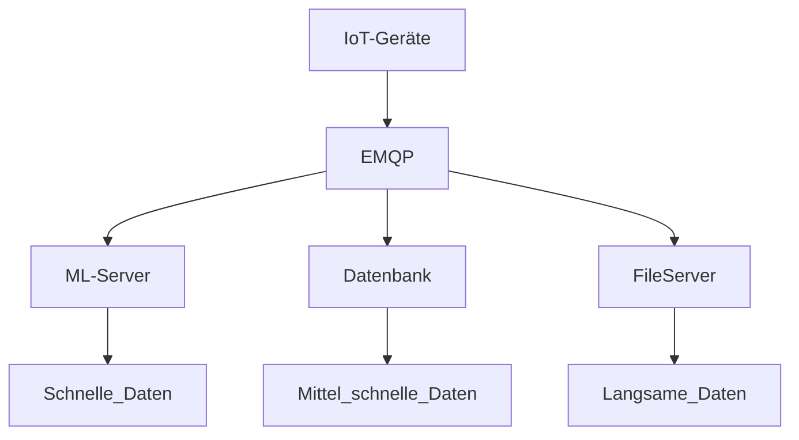
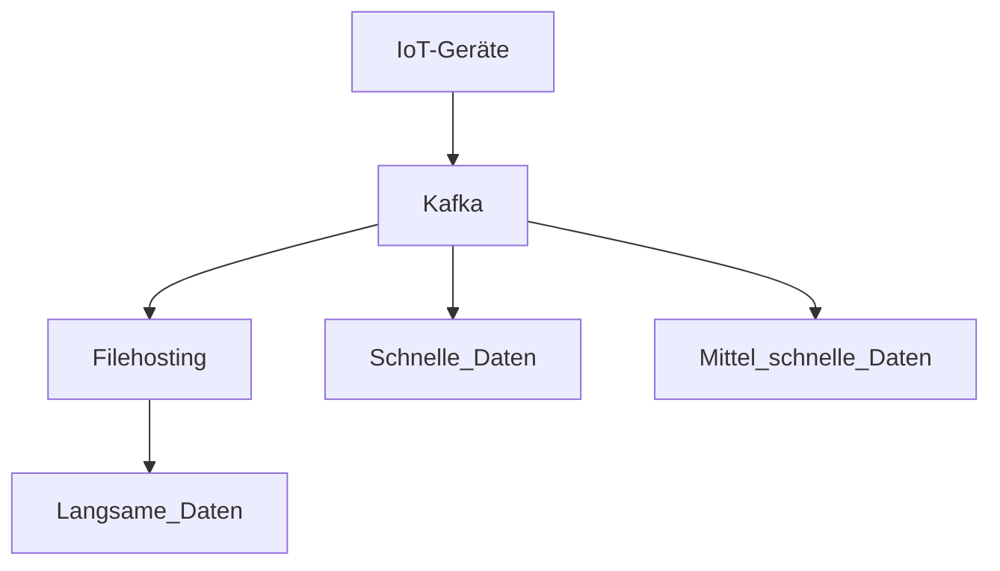

# Kafka Simulation

## Basiert auf meiner Abschlussarbeit

### Übersicht

**Alter Aufbau**

**Neuer Aufbau**

---

### Anforderungen

- Sicherheit  
- Throughput  
- Latenz  
- Versionierung  
- Kafka-Konfiguration  
- Kosten  

### Erfolgskriterien

- Machbarkeit  
- Wettbewerbsvorteil  
